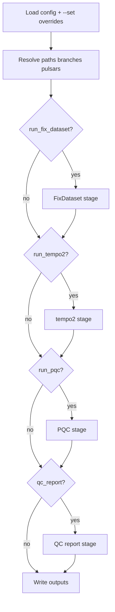
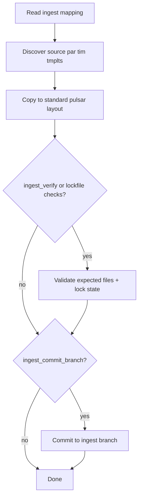
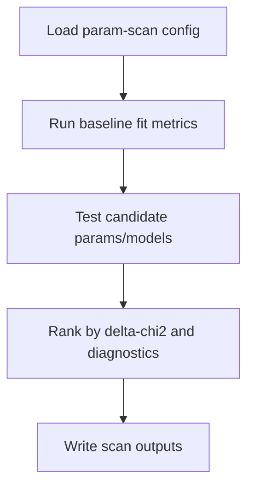
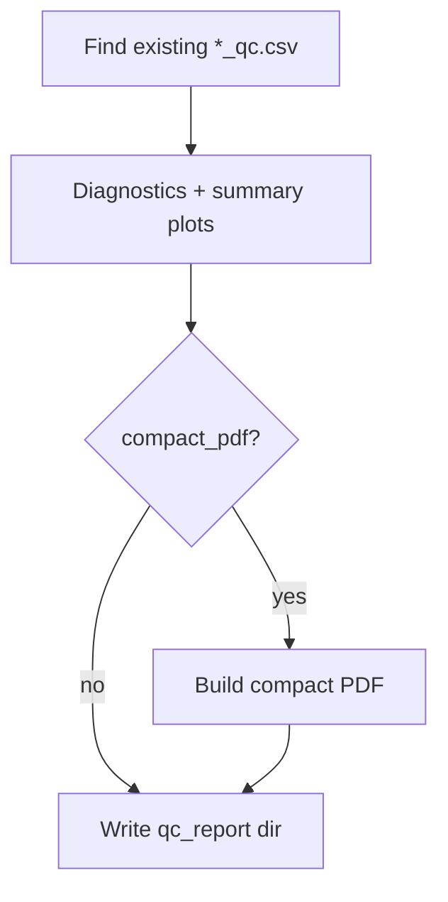
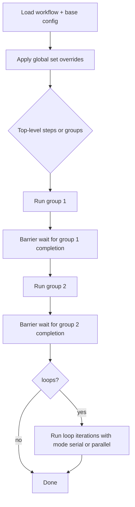
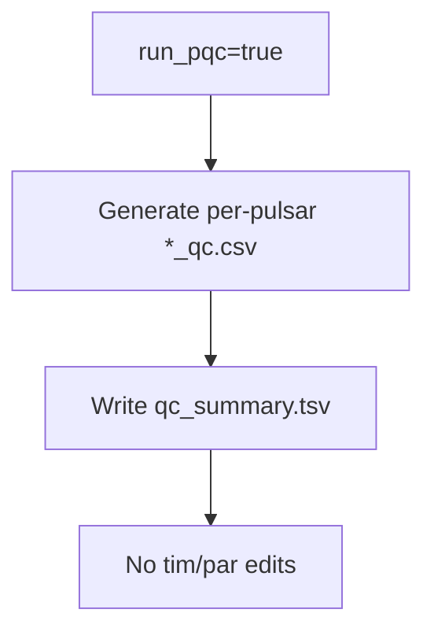
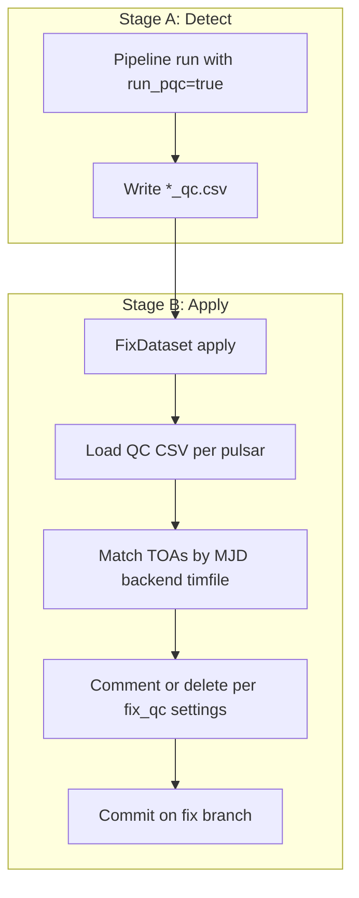
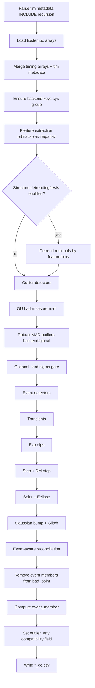

# pleb Flow Diagrams (Mermaid)

## Pipeline Mode

## Ingest Mode

## Param-Scan Mode

## QC-Report Mode

## Workflow Mode (Serial + Parallel Groups)

## PQC Usage: Detection Only

## PQC Usage: Detect Then Apply Comments

## PQC Detection Sequence (Outliers + Events)

